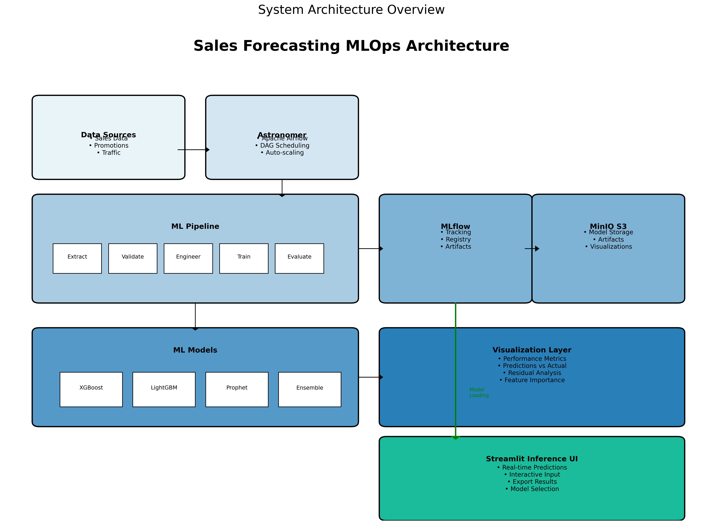
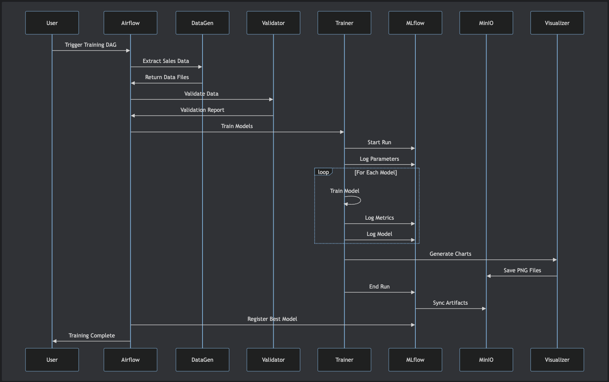
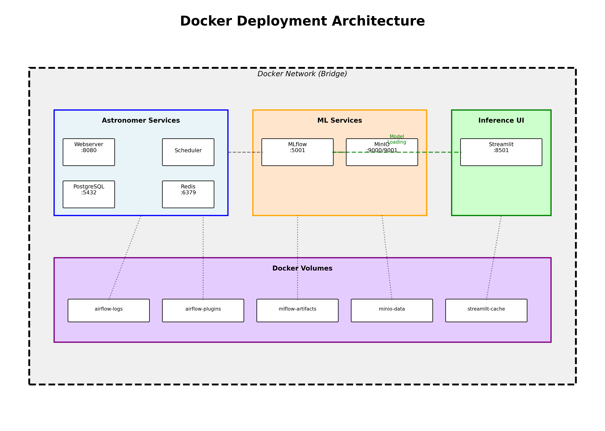
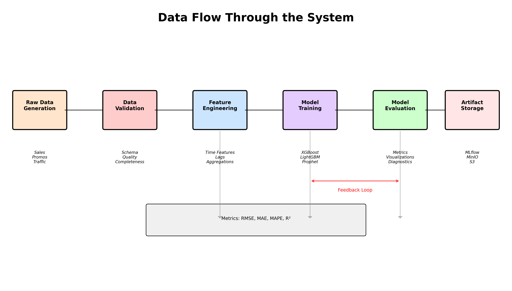
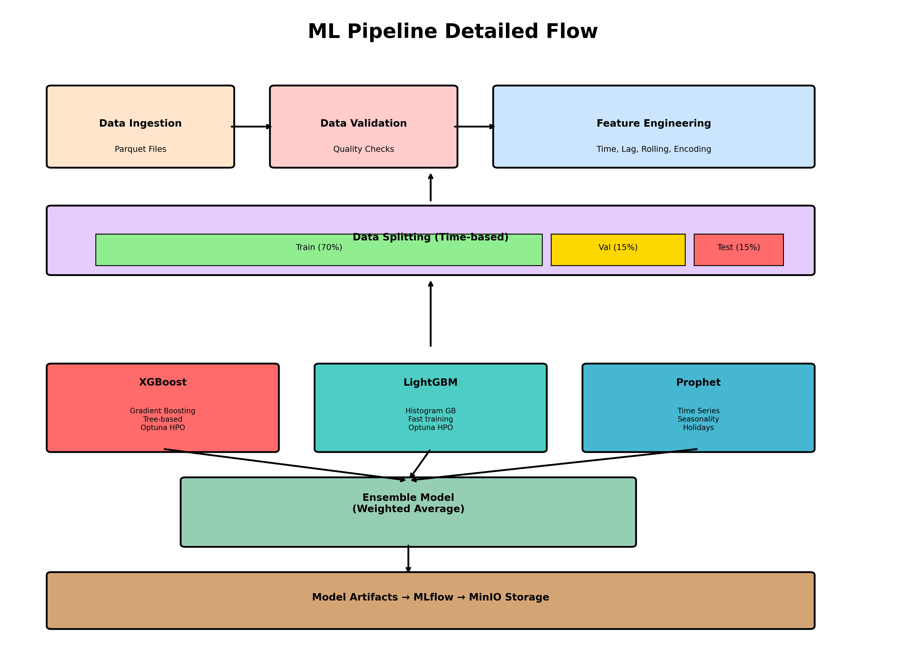
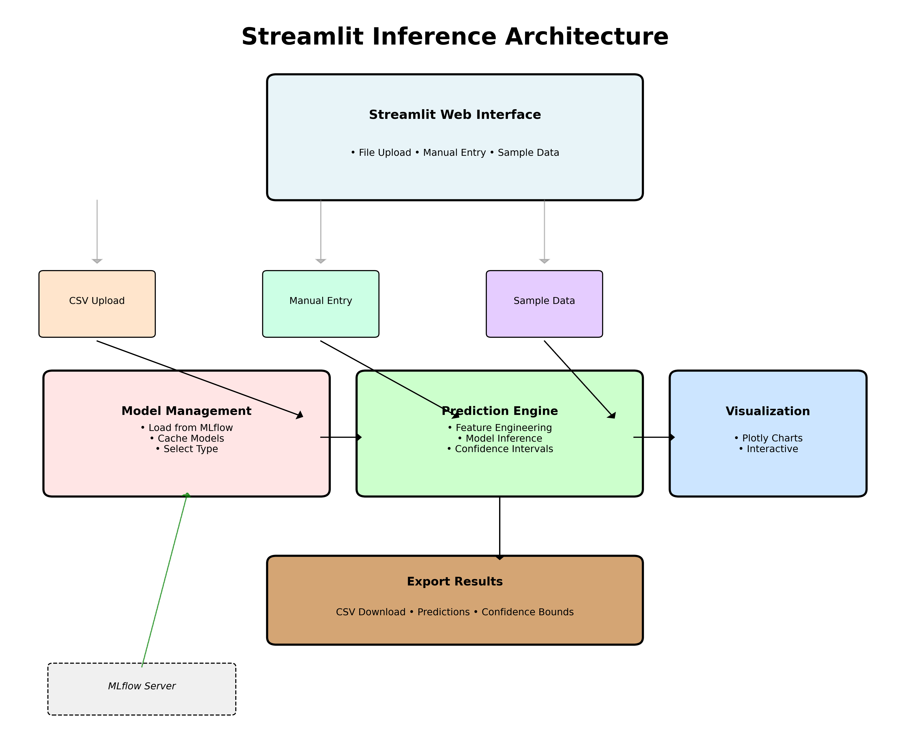
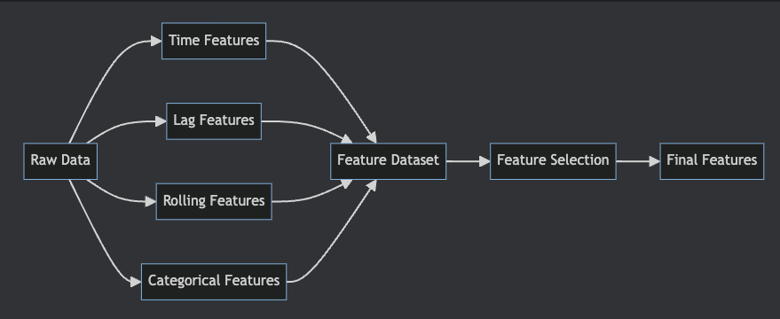
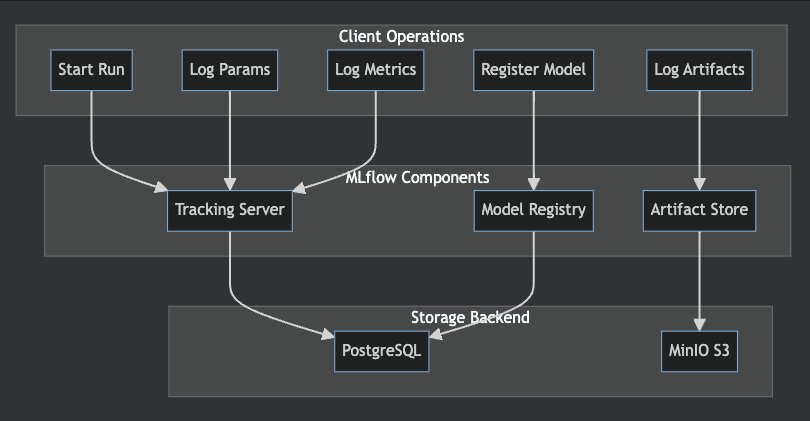
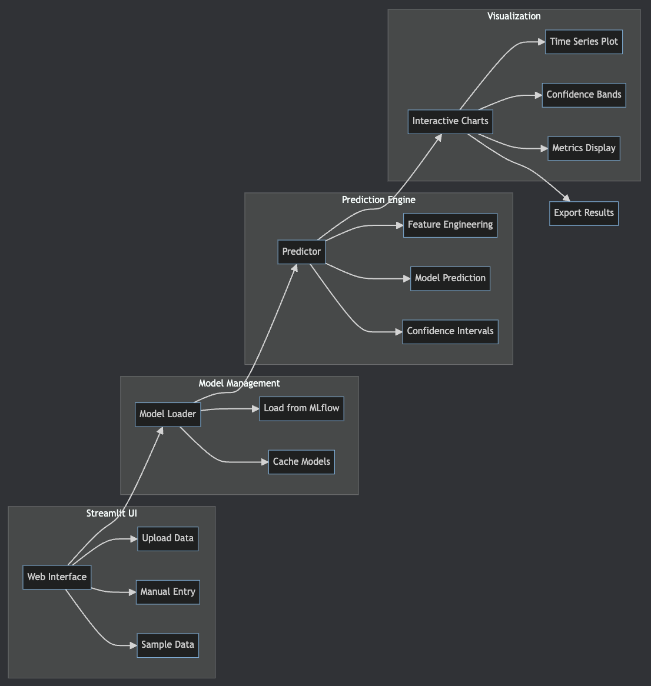

# Sales Forecasting MLOps using Astro

## Table of Contents
1. [Overview](#overview)
2. [Architecture Diagram](#architecture-diagram)
3. [Technology Stack](#technology-stack)
4. [Component Details](#component-details)
5. [Data Flow](#data-flow)
6. [ML Pipeline](#ml-pipeline)
7. [Deployment Architecture](#deployment-architecture)
8. [Inference System](#inference-system)
9. [Best Practices](#best-practices)
10. [Learning Objectives](#learning-objectives)
11. [Hands-on Exercises](#hands-on-exercises)

## Overview

This project demonstrates a production-ready MLOps pipeline for sales forecasting using Apache Airflow (via Astronomer), MLflow, MinIO, and modern machine learning techniques. It includes ensemble modeling, comprehensive visualization capabilities, and a Streamlit-based inference interface. The system is designed to teach students how to build scalable, maintainable ML systems in real-world scenarios.

### Key Features
- **Automated ML Pipeline**: End-to-end automation from data ingestion to model deployment
- **Experiment Tracking**: Comprehensive tracking of experiments, metrics, and artifacts
- **Model Registry**: Centralized model versioning and lifecycle management
- **Distributed Storage**: S3-compatible object storage for artifacts
- **Monitoring & Visualization**: Advanced model performance visualization and comparison tools
- **Ensemble Modeling**: Combines XGBoost, LightGBM, and Prophet for robust predictions
- **Interactive Inference**: Streamlit-based UI for real-time predictions and analysis
- **Astronomer Integration**: Enterprise-grade Airflow deployment and management
- **Containerized Deployment**: Docker-based deployment for consistency across environments

## Architecture Diagrams

### High-Level System Architecture

### Component Interaction Diagram

### Deployment Architecture

### Data Flow Through the System

### ML Pipeline Flow

### Inference System Architecture

## Technology Stack

### Core Technologies

| Component | Technology | Purpose |
|-----------|------------|---------|
| **Orchestration** | Astronomer (Apache Airflow 2.10+) | Enterprise-grade workflow orchestration |
| **ML Tracking** | MLflow 2.9+ | Experiment tracking, model registry |
| **Object Storage** | MinIO | S3-compatible artifact storage |
| **Containerization** | Docker & Docker Compose | Environment consistency |
| **ML Frameworks** | XGBoost, LightGBM, Prophet | Gradient boosting and time series models |
| **Data Processing** | Pandas, NumPy | Data manipulation and analysis |
| **Visualization** | Matplotlib, Seaborn, Plotly | Advanced model visualization |
| **Inference UI** | Streamlit | Interactive prediction interface |
| **Hyperparameter Tuning** | Optuna | Bayesian optimization |

## Component Details

### 1. Feature Engineering Pipeline

The feature engineering pipeline transforms raw sales data into rich features for model training:

**Components:**
- **Time Features**: Day of week, month, quarter, holidays
- **Lag Features**: Previous sales values (1, 7, 30 days)
- **Rolling Features**: Moving averages, std deviation
- **Categorical Encoding**: Store ID, product categories

### 2. MLflow Integration

MLflow serves as the central hub for experiment tracking and model management:
- **Experiment Tracking**: Logs metrics, parameters, and artifacts
- **Model Registry**: Versioned model storage with stage transitions
- **Artifact Storage**: Integrates with MinIO for S3-compatible storage

## Data Flow

### Training Data Flow
The data flow diagram illustrates how data moves through the system from generation to model artifacts:
1. **Raw Data Generation**: Synthetic sales data with realistic patterns
2. **Data Validation**: Schema and quality checks
3. **Feature Engineering**: Time-based and aggregated features
4. **Model Training**: Parallel training of multiple models
5. **Model Evaluation**: Performance metrics and visualizations
6. **Artifact Storage**: Models and results saved to MLflow/MinIO

### ML Pipeline Details
The ML pipeline encompasses the complete workflow from data ingestion to model deployment:
- **Data Splitting**: Time-based train/validation/test splits (70/15/15)
- **Model Training**: Parallel training with hyperparameter optimization
- **Ensemble Creation**: Weighted average of individual models
- **Artifact Management**: Automated storage and versioning

## Inference System

### Streamlit-Based Prediction Interface

The inference system provides an intuitive web interface for generating sales forecasts:

### Key Features:

1. **Multiple Input Methods**
   - CSV file upload with validation
   - Manual data entry (7-day grid)
   - Sample data generation with customizable parameters

2. **Model Selection**
   - Individual models (XGBoost, LightGBM)
   - Ensemble model (weighted combination)
   - Dynamic model loading from MLflow

3. **Interactive Visualizations**
   - Real-time prediction plots using Plotly
   - Historical vs forecast comparison
   - 95% confidence intervals
   - Hover tooltips with detailed information

4. **Export Capabilities**
   - CSV download of predictions
   - Includes confidence bounds
   - Timestamped filenames

## Deployment Architecture

### Docker-Based Deployment
The system uses Docker Compose for containerized deployment with the following services:

1. **Astronomer Services**
   - Airflow Webserver (port 8080)
   - Airflow Scheduler
   - PostgreSQL Database
   - Redis Message Broker

2. **ML Services**
   - MLflow Server (port 5001)
   - MinIO Object Storage (ports 9000/9001)

3. **Inference Services**
   - Streamlit UI (port 8501)

4. **Persistent Volumes**
   - airflow-logs: DAG execution logs
   - airflow-plugins: Custom plugins
   - mlflow-artifacts: Model artifacts
   - minio-data: Object storage
   - streamlit-cache: Application cache

### Network Architecture
All services communicate through a Docker bridge network, enabling:
- Service discovery by container name
- Isolated network environment
- Port mapping for external access
- Inter-service communication

## System Integration

### Astronomer Platform Integration
The project leverages Astronomer's enterprise Airflow platform for:
- **Managed Airflow**: Pre-configured, optimized Airflow deployment
- **Auto-scaling**: Dynamic resource allocation based on workload
- **Monitoring**: Built-in observability and alerting
- **Security**: Enterprise-grade authentication and authorization
- **CLI Tools**: Simplified deployment and management

### Key Integration Points
1. **DAG Deployment**: Automated DAG synchronization via Astronomer CLI
2. **Environment Management**: Consistent Python dependencies across all workers
3. **Resource Optimization**: Efficient task distribution and execution
4. **Logging & Monitoring**: Centralized log aggregation and metrics
